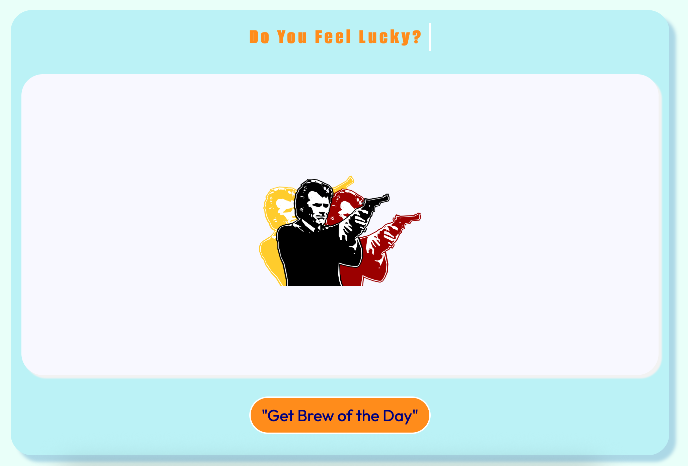
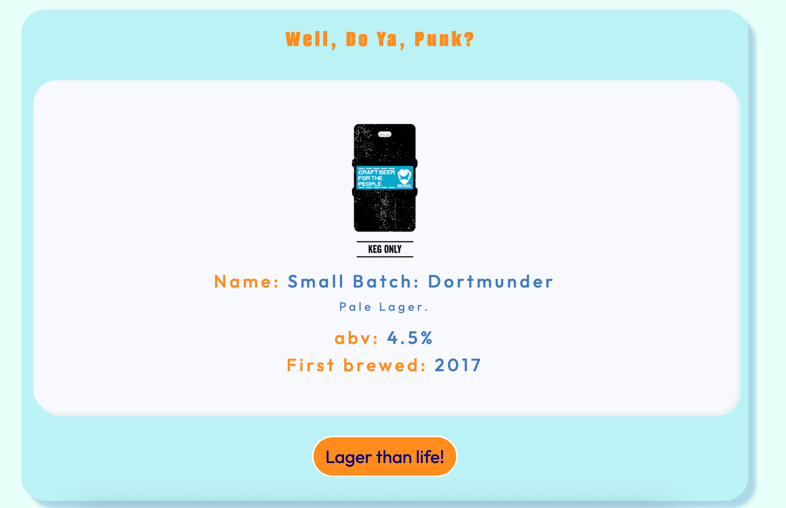
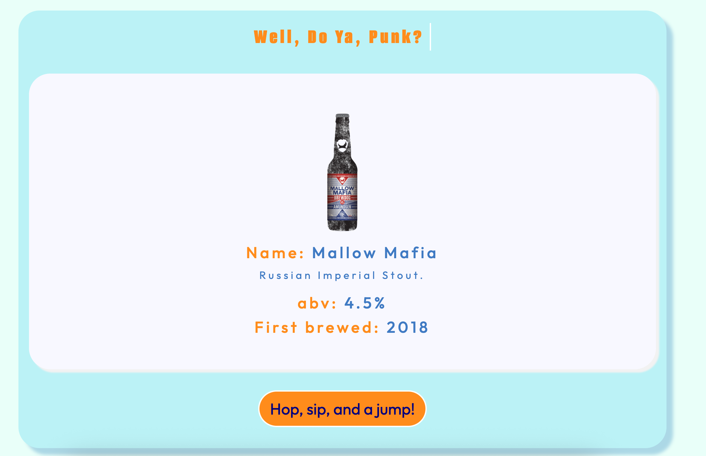

# Brewdog of the Day - A fun "Brewdog" themed app based on the classic random quote generator!

## Table of contents

- [Overview](#overview)
  - [The challenge](#the-challenge)
  - [Screenshot](#screenshot)
  - [Links](#links)
- [My process](#my-process)
  - [Built with](#built-with)
  - [What I learned](#what-i-learned)
  - [Continued development](#continued-development)
  - [Useful resources](#useful-resources)

## Overview

This original project that this app is based on was part of the WesBos JavaScript Course. I have made quite a few changes to the original app to practice skills I learnt during the course and beyond. The main changes I made were changing the API, adding a typing effect and adding a loader.
### The challenge

Users should be able to:

- Request a new random beer
- Recieve a new random beer
- Also recieve a new beer related quote in the button text

### Screenshot

### Links

- Solution URL: (https://github.com/LaurenAMolloy/brewdog-of-the-day)
- Live Site URL: (https://brewdog-of-the-day.onrender.com/)

### Built with

- JavaScript
- Semantic HTML5 markup
- CSS custom properties
- Flexbox

### What I learned

I have learnt so many new skills and concepts during the build of this project. 
- DOM Manipulation
- Fetching data and displaying data from API's
- Events
- Async Functions
- Using Template Literals
- Set Timeout
- Math Methods

### Continued development

Moving forward I would like to continue learning about and experiment more with integrating data from API's. I would like to migrate some of my vanilla js projects into React projects to get more experience working with SPA's.

### Useful resources

- [Punk API Link ](https://www.freepublicapis.com/punkapi) - This site includesthe API information and various endpoints available.
- [Punk API Repo Link ](https://github.com/alxiw/punkapi?ref=freepublicapis.com) - Repo for the API.

